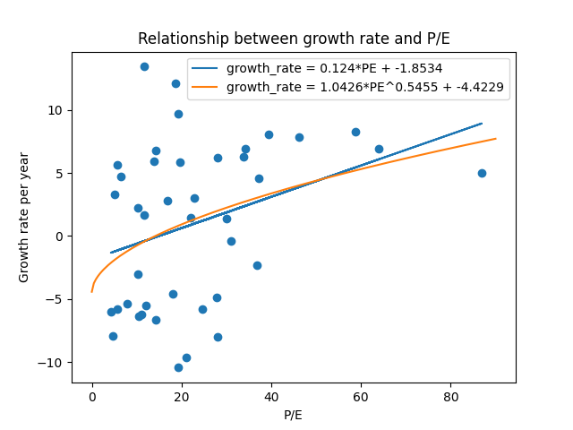

b# Introduction
When investing in companies, we want to choose the ones that will give us the highest returns over time. One of the common ways this is achieved are capital gains, meaning that the price of companies' stocks increased, and we sold it at a higher value. To find the most likely companies to grow in the future, we look at several data points about them. Two such statistics we are going to look at include stock price, and earning per share (yearly). If we divide stock price, and EPS, we get P/E ratio. P/E ratio hence indicates how many years would it take at the current rate for earning from this company to cover the cost of the share we bought. Therefore, if earnings did not grow, it would not make sense for people to wait longer for their investment to bear fruit. Hence, investors would only invest in it, if they thought the companies' revenue would increase in the future. But if revenue increses the total value the investors value the company should increase, and hence the stock price should go up. Therefore, if P/E did not correlate with higher future growth, it would make no sense to invest in them, and investors would be investing in a bubble. Henceforth, I am going to analyze whether higher P/E companies have higher growth rates in the future.

# Data collection
All the data were collected from [TradingView](https://www.tradingview.com/markets/stocks-usa/market-movers-all-stocks/), from their all US stocks list. [The version from end of June](./Data/TradingView-2024.html) was downloaded directed from TradingView, and [August 2022 version](./Data/TradingView-2022.html) comes from [web.archive.org](https://web.archive.org/web/20220827030431/https://www.tradingview.com/markets/stocks-usa/market-movers-all-stocks/).  

The archived version gave me access to first 100 companies alphabetically, which are sold on US stock exchanges. I have looked, whether the selection could be considered as a random sample of US companies, and the companies were from all industries, and ranged from small to giants, and hence are a good representation of the US stock market overall.

The August 2022 was chosen because companies were not effected by COVID by then, and hence were operating like they normally would. Therefore, we will not be measuring compared to abnormal era, which would result in many outliers.

The data were parsed from downloaded html files in [CompanyStats.py](./CompanyStats.py)
```py
from dataclasses import dataclass
from bs4 import BeautifulSoup
import re

@dataclass
class Company:
    ticket: str
    price: float = None
    pe: float = None

class CompanyStats:
    findTag = {
        2022: {
            "company_div": ("tr", "row-iVZpYhgj listRow"),
            "ticket": ("a", "apply-common-tooltip tickerName-absbzmSX"),
            "columns": ("td", "cell-s_9Ijkac right-s_9Ijkac"),
            "priceIdx": 0,
            "peIdx": lambda columns: 6 if len(columns) == 9 else 4
        },

        2024: {
            "company_div": ("tr", "row-RdUXZpkv listRow"),
            "ticket": ("a", "apply-common-tooltip tickerNameBox-GrtoTeat tickerName-GrtoTeat"),
            "columns": ("td", "cell-RLhfr_y4 right-RLhfr_y4"),
            "priceIdx": 0,
            "peIdx": lambda columns: 5
        }
    }
    
    def __init__(self, filename: str, year: int):
        with open(filename) as file:
            searchTags = CompanyStats.findTag[year]
            soup: BeautifulSoup = BeautifulSoup(file, "html.parser")
            companies = soup.find_all(searchTags["company_div"][0], attrs={"class": searchTags["company_div"][1]})
            self.stats = {}
            for company in companies:
                ticket = company.find(searchTags["ticket"][0], attrs={"class": searchTags["ticket"][1]}).text

                columns = company.find_all(searchTags["columns"][0], attrs={"class": searchTags["columns"][1]})

                priceIdx = searchTags["priceIdx"]
                peIdx = searchTags["peIdx"](columns)

                if len(columns) == 0: continue

                price = float(re.findall("\\d+\\.\\d+", columns[priceIdx].text)[0]) # Do not care about currency
                pe = float(columns[peIdx].text) if columns[peIdx].text != "—" else None

                self.stats[ticket] = Company(ticket, price, pe)

    def getStats(self) -> dict:
        return self.stats

```

After parsing both files, I only saved companies, which were present in both files, and had required info filled in. We are left with 75 companies.
```py
import scipy

from CompanyStats import CompanyStats
import numpy as np
import matplotlib.pyplot as plt

stats2022: dict = CompanyStats("Data/TradingView-2022.html", 2022).getStats()
stats2024: dict = CompanyStats("Data/TradingView-2024.html", 2024).getStats()

number_of_years_between = 22 / 12

ignore_companies = {}

common_companies = stats2022.keys() & stats2024.keys()

companies = [stats2022[company] for company in common_companies if (stats2022[company].pe
             is not None and company not in ignore_companies)]


previous_pe = np.array([company.pe for company in companies])
growth_rates = np.array([((stats2024[company.ticket].price / stats2022[company.ticket].price) - 1) * 100 for company in companies])
growth_rates = np.sign(growth_rates) * (np.abs(growth_rates) ** (1 / number_of_years_between)) # Deals with negative growth rates
```

# Data analysis
Since we want to find whether growth rate changes with P/E, we can use linear regression, and set our null hypothesis to slope being zero, and alternative hypothesis to growth rate is correlated with P/E.
```py
slope, intercept, r_value, p_value, std_err = scipy.stats.linregress(previous_pe, growth_rates)
 print("Linear regression")
print(f"growth_rate = {round(slope, 4)}*PE + {round(intercept, 4)}")
print(f"r^2 = {round(r_value ** 2, 4)}")
print(f"p = {round(p_value, 4)}")
```
We get linear function of $growth_rate = 0.124*PE - 1.8534$. 
PE determines 11.16% of growth rate ($r^2$), and the probability that we would get this data by chance, and the real slope would be 0 is 3.38%, which is  below our significance level, and hence I reject the null hypothesis.

Even though we found that they are correlated, the fit is really poor. Hence to model data better, I can use idea, that since the growth is exponential, and the dominant term will be the last year. I can approximate, how much growth would be necessary, to match the lower P/E company.

Let $r$ be the ratio of P/E of two companies, and $g$ the ratio between growth rates, and $y$ number of years of growth.
$$r = g^y$$
$$r^{1/y} = g$$

```py
slope_sqrt, intercept_sqrt, r_value_sqrt, p_value_sqrt, std_err = scipy.stats.linregress(
    previous_pe ** (1 / number_of_years_between), growth_rates)
print("Root regression")
print(f"growth_rate = {round(slope_sqrt, 4)}*PE^{round(1 / number_of_years_between, 4)} + {round(intercept_sqrt, 4)}")
print(f"r^2 = {r_value_sqrt}")
print(f"p = {round(p_value_sqrt, 4)}")
```
Since the number of years is 22/12, the function we will get has a dominant term with exponent 12/22
The best fitting curve is $`growth\_rate = 1.0426*PE^{0.5455} - 4.4229$
$r^2$ increases a lot to 33.76%, and $p$ with the null hypothesis of constant function is 3.09%, which is under 5% significance level, hence I am again rejecting the null hypothesis.

Graph showing fit

```py
plt.title("Relationship between growth rate and P/E")
plt.xlabel("P/E")
plt.ylabel("Growth rate per year")
plt.scatter(previous_pe, growth_rates)
plt.plot(previous_pe, slope*previous_pe+intercept, label=f"growth_rate = {round(slope, 4)}*PE + {round(intercept, 4)}")

linearspace = np.linspace(0, 90, 200)
plt.plot(linearspace, slope_sqrt*(linearspace**(1 / number_of_years_between)) + intercept_sqrt, label = f"growth_rate = {round(slope_sqrt, 4)}*PE^{round(1 / number_of_years_between, 4)} + {round(intercept_sqrt, 4)}")

plt.legend()
plt.savefig("growth_pe_graph.png")
plt.show()
```




# Discussion
Concerning outliers, I did not want to blindly delete data points outside range. Due to the nature of this problem, where people want to find company, with possibility of large returns, and risking that it will be a bubble, and drop. The other option of reasonably valued company growing well. Since people cherry-pick stocks to maximize returns, it would not make sense to exclude them.

I tried looking whether some of the outliers had some event, that would disqualify them, such them having P/E drastically changed few days after the old snapshot, meaning we worked with data really out of date. Or whether drastically changed just for a moment when we took a snapshot. I did not find any discrepancies, so I did not exclude anyone.

Looking at the graph, we can say that low P/E does not mean low growth. In fact, some of the fastest growing companies had P/E < 20. However, this is likely due to there being much more companies at this range, and the chance of an outlier is larger.

Despite there being companies with smaller P/E, and a higher growth. The probability of company with smaller P/E having bad growth is much larger than company with high P/E having bad growth.

In the end, we can say that higher P/E companies have a higher growth rate, but not by much.